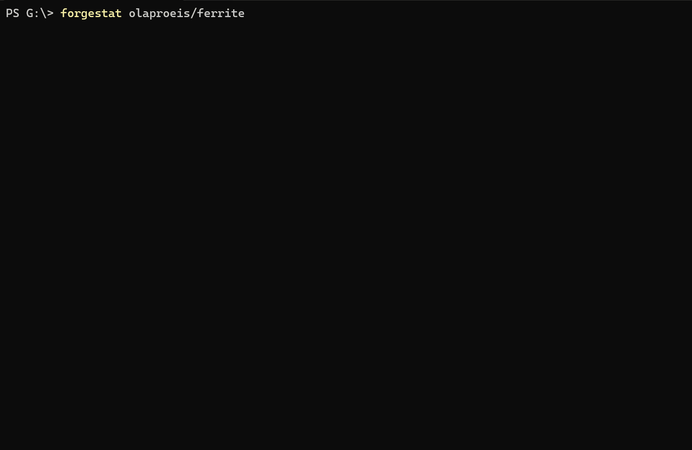

<div align="center">


[](LICENSE)
[](https://www.rust-lang.org/)
[](https://github.com/olaproeis/forgeStat)

**A real-time GitHub repository dashboard for your terminal.**

forgeStat gives open-source maintainers and contributors a single-screen view of everything happening in a repository — stars, issues, PRs, contributors, releases, velocity, and security alerts — all without leaving the terminal.

> Built for the open-source community: the people who maintain, contribute to, and depend on GitHub projects every day.

</div>



## Why forgeStat?

Open-source maintainers juggle GitHub's web UI, email notifications, third-party dashboards, and analytics tools just to answer basic questions: *Is my project growing? Are issues piling up? Who's contributing? Are there security problems?*

forgeStat puts all of that in one terminal command. No browser tabs, no SaaS signups, no context switching.

## Features

### 8 Metric Panels


| Panel | What it shows |
|-------|---------------|
| **Stars** | Total count + sparkline charts (30-day, 90-day, 1-year trends) + milestone prediction |
| **Issues** | Open issues grouped by label, sortable, with age and comment count |
| **Pull Requests** | Open, draft, ready, merged (30d) counts + average merge time |
| **Contributors** | Top contributors by commits + new contributors (last 30 days) |
| **Releases** | Release history with publish dates, pre-release tags, avg interval |
| **Velocity** | Weekly opened vs closed/merged for issues and PRs (4/8/12 weeks) |
| **Security** | Dependabot vulnerability alerts broken down by severity |
| **CI Status** | GitHub Actions success rate, recent runs, average duration |

### Repository Health Score

forgeStat calculates a comprehensive **Health Score** (0-100) for any repository based on four key dimensions:


| Sub-Score | Weight | Factors |
|-----------|--------|---------|
| **Activity** | 25% | Commit velocity, PR merge rate/speed, CI success rate |
| **Community** | 25% | Contributor diversity, new contributors, issue engagement |
| **Maintenance** | 25% | Release cadence, security alerts, community health files |
| **Growth** | 25% | Star trends, forks, watchers |

**Grade Scale:** Excellent (90-100) · Good (75-89) · Fair (50-74) · Needs Attention (25-49) · Critical (0-24)

The health score appears in the status bar, mini-map, zoom views, JSON output, summary reports, and markdown exports.

### Star Milestone Prediction

Based on 30-day and 90-day growth trends, forgeStat predicts when your repository will reach the next star milestone (100, 500, 1K, 5K, 10K, 25K, 50K, 100K). Displayed in Stars zoom view, summary output, and reports.

### Interactive TUI

- **Zoom mode** — Expand any panel to full-screen detail view (`Enter`)
- **Mini-map** — Bird's-eye overview of all metrics at once (`m`)
- **Search & filter** — Filter issues by label, search contributors/releases (`/`, `l`, `p`)
- **Timeframe controls** — Adjust chart periods and list sizes per panel (`+`/`-`)
- **Mouse support** — Click to select panels, drag borders to resize, scroll lists
- **Resizable layout** — Drag-to-resize panels with persistence across sessions
- **Keyboard navigation** — `Tab`/arrow keys, number keys `1`-`8` for direct panel jump

### CLI Output Modes

When you don't need the full TUI, forgeStat offers several output formats:

**JSON Export** (`--json`)
```bash
forgeStat owner/repo --json
```
Complete repository snapshot as formatted JSON including all metrics and health score. Perfect for scripting and data pipelines.

**Summary View** (`--summary`)
```bash
forgeStat owner/repo --summary
```
Compact human-readable summary with color-coded metrics and health score — ideal for quick status checks.

**Markdown Report** (`--report`)
```bash
forgeStat owner/repo --report              # Print to stdout
forgeStat owner/repo --report --report-file health.md
```
Generate a comprehensive health report in Markdown format, perfect for documentation, PRs, or team updates.

**Multi-Repo Watchlist** (`--watchlist`)
```bash
forgeStat --watchlist                       # Use watchlist.toml config
forgeStat --watchlist owner/repo1,owner/repo2  # Comma-separated repos
```
Dashboard view showing multiple repositories in a table format with health scores, stars, issues, and PRs. Press `Enter` to drill into a specific repo.

**Compare Mode** (`--compare`)
```bash
forgeStat owner/repo1 --compare owner/repo2
```
Side-by-side comparison of two repositories with winner highlighting and delta calculations.

### Diff Mode

Press `d` to compare the current snapshot against the previous one in a split-screen view. See deltas for stars, issues, PRs, security alerts, contributors, forks, and watchers at a glance.

### Command Palette

Press `:` for a Vim-style command palette with autocomplete and command history:
- `:set-token` — Add your GitHub token for higher rate limits and private repos
- `:theme <name>` — Switch between 6 built-in themes
- `:layout <preset>` — Switch between layout presets (default, compact, wide)
- `:refresh` — Force data refresh
- `:help` — Show keyboard shortcuts

### Fuzzy Finder & Repo Switching

Press `f` to search and switch between previously viewed repositories without leaving the app. Also supports CLI piping with `fzf`:

```bash
forgeStat --list | fzf | forgeStat --from-stdin
```

### Copy to Clipboard

Press `c` to copy context-sensitive data — repo URL, issue reference, contributor username, or release tag — with a toast notification confirming the copy.

### 6 Built-in Themes

`default` · `monochrome` · `high-contrast` · `solarized-dark` · `dracula` · `gruvbox`

Plus full custom theme support via TOML. Toggle Braille sparklines for 2x resolution charts.

### Animations

Panel flash on data change, count-up number animations, sync pulse, and a Braille spinner — all with a low-power mode for battery-conscious users. Fully configurable via `animation.toml`.

### Smart Caching & Offline Mode

- 15-minute TTL with automatic staleness detection
- Rolling snapshot history (up to 20 snapshots, 30-day retention)
- Full offline fallback — works without internet using cached data
- Auto-refresh every 10 minutes, manual refresh with `r`
- UI state (scroll positions, last viewed) persisted across sessions

### Loading Screen with Progress & Mini-Game

When fetching data for large repositories, forgeStat displays a loading screen with real-time progress:

**Progress Tracking**
- Page-by-page progress during star history fetch (e.g., "page 12/100 (12%)")
- Shows which endpoint is currently being fetched
- Smooth progress bar that fills as data loads

**Large Repository Warning**
For repositories with >5,000 stars, a warning is displayed:
> ⚠ This repo has 182.2k stars - loading may take a while!

**Pong Mini-Game**
While waiting for large repos to load, press `Space` or `Enter` to play Pong:
- Use `↑`/`↓` arrow keys to control the left paddle
- Ball bounces off paddles and walls
- Score tracking (You vs AI)
- Game auto-appears for repos with >5,000 stars

> **Note:** Loading large repositories (like `microsoft/vscode` with 180k+ stars) can take 1-2 minutes due to GitHub API pagination limits. The cache will make subsequent loads instant.

## Installation

### Quick Install (One Command)

#### Windows (PowerShell)

```powershell
iwr https://github.com/OlaProeis/forgeStat/releases/latest/download/install.ps1 -UseBasicParsing | iex
```

Or download the [MSI installer](https://github.com/OlaProeis/forgeStat/releases/latest) and run it.

#### macOS

```bash
curl -fsSL https://github.com/OlaProeis/forgeStat/releases/latest/download/install.sh | bash
```

#### Linux

```bash
curl -fsSL https://github.com/OlaProeis/forgeStat/releases/latest/download/install.sh | bash
```

### Homebrew (macOS/Linux)

```bash
brew tap olaproeis/tap
brew install forgeStat
```

### Cargo Install

```bash
cargo install forgeStat
```

### Manual Download

Download pre-built binaries from the [releases page](https://github.com/OlaProeis/forgeStat/releases):

- **Windows**: `forgeStat-v0.1.0-x86_64-pc-windows-msvc.msi` (installer) or `.zip`
- **macOS Intel**: `forgeStat-v0.1.0-x86_64-apple-darwin.tar.gz`
- **macOS Apple Silicon**: `forgeStat-v0.1.0-aarch64-apple-darwin.tar.gz`
- **Linux**: `forgeStat-v0.1.0-x86_64-unknown-linux-gnu.tar.gz`

### Cargo

```bash
cargo install forgeStat
```

### From source (requires Rust 1.74+)

```bash
git clone https://github.com/olaproeis/forgeStat.git
cd forgeStat
cargo build --release
# Binary will be at ./target/release/forgeStat
```

### Quick run (without installing)

```bash
cargo run -- owner/repo
```

## Usage

```bash
forgeStat owner/repo                    # Launch TUI (default)
forgeStat owner/repo --json             # Export JSON to stdout
forgeStat owner/repo --summary          # Compact summary view
forgeStat owner/repo --report           # Markdown report
forgeStat --watchlist                   # Multi-repo dashboard
forgeStat owner/repo1 --compare repo2   # Compare two repos
forgeStat --list                        # List cached repositories
forgeStat --from-stdin                  # Read repo from stdin (pipe with fzf)
```

**First time?** Just run `forgeStat owner/repo` — no setup needed! Add your GitHub token later with `:set-token` for more features.

### Examples

```bash
# Interactive TUI
forgeStat ratatui-org/ratatui
forgeStat torvalds/linux
forgeStat rust-lang/rust

# CLI output modes
forgeStat microsoft/vscode --json > vscode-metrics.json
forgeStat facebook/react --summary
forgeStat google/go --report --report-file go-health.md

# Multi-repo monitoring
forgeStat --watchlist torvalds/linux,rust-lang/rust,microsoft/vscode

# Compare repositories
forgeStat react --compare vue
```

## Keyboard Shortcuts

### Navigation

| Key | Action |
|-----|--------|
| `Tab` / `→` | Next panel |
| `Shift+Tab` / `←` | Previous panel |
| `1`–`8` | Jump to panel directly |
| `↑` / `↓` | Scroll within panel |
| `Enter` | Toggle zoom (full-screen panel) |
| `m` | Toggle mini-map overview |
| `f` | Open fuzzy finder (repo switcher) |
| `d` | Toggle diff mode (snapshot comparison) |

### Actions

| Key | Action |
|-----|--------|
| `r` | Refresh data |
| `c` | Copy to clipboard (context-sensitive) |
| `/` | Search / filter (Issues, Contributors, Releases) |
| `l` | Cycle label filter (Issues panel) |
| `p` | Cycle prerelease filter (Releases panel) |
| `+` / `]` | Increase timeframe / page size |
| `-` / `[` | Decrease timeframe / page size |
| `=` | Reset layout to defaults |
| `:` | Open command palette |
| `?` | Toggle help overlay |
| `q` | Quit |

### Mouse

| Action | Effect |
|--------|--------|
| Click panel | Select panel |
| Drag border | Resize panels |
| Scroll | Scroll lists |

## Authentication

**No setup required!** forgeStat works out of the box for public repositories (60 requests/hour).

### Interactive Token Setup (Recommended)

The easiest way to add your GitHub token is through the app itself:

1. **Press `:`** to open the command palette
2. **Type `:set-token`** and press Enter
3. **Paste your GitHub Personal Access Token**
4. Press **Enter** to save

Your token is securely saved and the app will refresh automatically.

### Why Add a Token?

| Feature | Without Token | With Token |
|---------|---------------|------------|
| Rate limit | 60 req/hour | 5,000 req/hour |
| Private repos | ❌ | ✅ |
| Security alerts | ❌ | ✅ |
| CI status | ❌ | ✅ |

### Creating a GitHub Token

1. Go to [GitHub Settings → Developer settings → Personal access tokens](https://github.com/settings/tokens)
2. Click **Generate new token (classic)**
3. Select scopes: `repo` (for private repos), `security_events` (for security alerts)
4. Copy and paste into the app via `:set-token`

### Advanced: Manual Configuration

**Environment variable:**
```bash
export GITHUB_TOKEN=ghp_your_token_here  # Linux/macOS
$env:GITHUB_TOKEN = "ghp_your_token_here" # Windows PowerShell
```

**Config file:**
| Platform | Path |
|----------|------|
| Linux/macOS | `~/.config/forgeStat/config.toml` |
| Windows | `%APPDATA%\forgeStat\config.toml` |

```toml
github_token = "ghp_your_token_here"
```

## Configuration

All configuration is optional. forgeStat works out of the box with sensible defaults.

### Theme (`theme.toml`)

```toml
theme = "dracula"       # default, monochrome, high-contrast, solarized-dark, dracula, gruvbox
braille_mode = true      # 2x resolution sparkline charts
```

### Status Bar (`statusbar.toml`)

Choose up to 3 metrics to display (from: `sync_state`, `rate_limit`, `open_issues`, `open_prs`, `last_release_age`, `oldest_issue_age`, `health_score`):

```toml
items = ["sync_state", "rate_limit", "health_score"]
```

### Layout (`layout.toml`)

```toml
preset = "default"       # default, compact, wide
```

### Animations (`animation.toml`)

```toml
enabled = true
low_power_mode = false   # Disables flash, count-up, sparkline draw
```

### Watchlist (`watchlist.toml`)

Configure repositories for the multi-repo dashboard:

```toml
repos = [
    "torvalds/linux",
    "rust-lang/rust",
    "ratatui-org/ratatui",
    "microsoft/vscode"
]
```

## Status Bar

The bottom status bar shows real-time information:

- **Health Score**: Repository grade (e.g., "Health: 87/100 (Good)") with color coding
- **Sync status**: `LIVE` (green) · `STALE` (yellow) · `OFFLINE` (red)
- **Rate limit**: Remaining API calls — turns yellow at 10%, red below 10
- **Panel hints**: Context-sensitive keyboard shortcuts for the selected panel

## Cache

Data is cached locally as JSON with cross-platform paths:

| Platform | Path |
|----------|------|
| Linux | `~/.local/share/repowatch/<owner>/<repo>/` |
| macOS | `~/Library/Application Support/repowatch/<owner>/<repo>/` |
| Windows | `%LOCALAPPDATA%\repowatch\<owner>\<repo>\` |

- `cache.json` — Current snapshot (15-min TTL)
- `history/` — Rolling snapshot history (max 20, purge after 30 days)
- `state.json` — UI state (scroll positions, last viewed time)

## Architecture


### Data Flow


## Tech Stack

| Purpose | Crate |
|---------|-------|
| TUI rendering | `ratatui` |
| GitHub API | `octocrab` + `reqwest` |
| Async runtime | `tokio` |
| Serialization | `serde` + `serde_json` |
| CLI arguments | `clap` |
| Date/time | `chrono` |
| Config files | `toml` |
| Clipboard | `arboard` |
| UUID generation | `uuid` |
| Fuzzy finder | `nucleo` |
| Terminal colors | `ansi_term` |

## License

MIT
